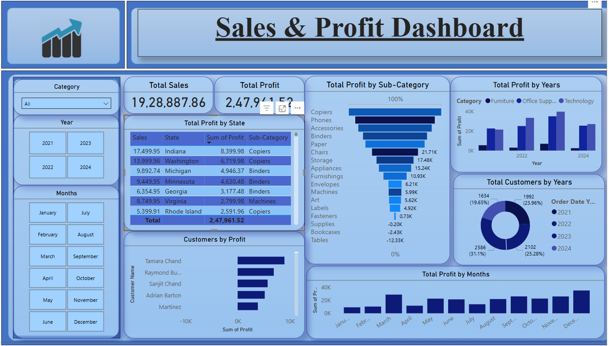

# 📈 Sales & Profit Dashboard

A visually rich and interactive Power BI dashboard designed to track and analyze total sales and profit trends across categories, time periods, sub-categories, and customers—helping businesses make informed, data-driven decisions.

## 📝 Short Description / Purpose

The Sales & Profit Dashboard is a comprehensive and interactive Power BI report built to help users understand sales performance and profit generation by state, customer, sub-category, year, and month. This tool is ideal for business analysts, sales teams, and decision-makers who want to uncover trends and optimize revenue strategies.

## 🛠 Tech Stack

The dashboard was built using the following tools and technologies: 
• 📊 **Power BI Desktop** – Primary tool for building the report and visuals. 
• 🧹 **Power Query** – Used for cleaning and transforming raw sales data. 
• 🧠 **DAX (Data Analysis Expressions)** – For creating calculated fields and KPIs. 
• 🔗 **Data Modeling** – Relationships built across fact and dimension tables. 
• 📁 **File Format** – `.pbix` for development and `.png` for dashboard snapshots.

## 📂 Data Source

**Source**: Sample superstore dataset (commonly used for BI dashboards).

Includes data on orders, sales, profits, sub-categories, customer names, order dates, and regional/state data, allowing time-series and categorical analysis.

## ✨ Features / Highlights

### • Business Problem

Sales teams and managers often struggle to identify high-performing products, profitable customers, and seasonal patterns without consolidated dashboards. The ability to break down profit by time, customer, and sub-category is essential for strategy.

### • Goal of the Dashboard

To deliver a user-friendly, business-ready dashboard that:
- Visualizes sales and profit metrics by month, state, year, and category.
- Highlights most and least profitable customer segments.
- Reveals trends in product sub-categories to inform inventory and marketing strategy.

### • Walkthrough of Key Visuals

- **Key KPIs (Top Center):**
  - Total Sales: ₹19,28,887.86
  - Total Profit: ₹2,47,941.52

- **Total Profit by Sub-Category (Bar Chart):**
  Highlights most profitable product types (e.g., Copiers, Phones) and loss drivers (e.g., Tables, Bookcases).

- **Profit by State (Line Chart):**
  Line graph showing correlation between sales and profit by region.

- **Total Profit by Year (Clustered Column Chart):**
  Compares yearly profit by product category: Furniture, Technology, Office Supplies.

- **Customers by Profit (Bar Chart):**
  Highlights top and bottom customers based on profit contribution.

- **Customer Count by Year (Donut Chart):**
  Tracks the number of customers acquired across years.

- **Monthly Profit Trends (Column Chart):**
  Helps identify high and low performing months across the year.

### • Business Impact & Insights

- **Product Strategy**: Identify underperforming sub-categories for improvement or replacement.
- **Customer Management**: Focus efforts on high-profit customers.
- **Regional Strategy**: Align marketing and supply chain with regional performance.
- **Revenue Forecasting**: Understand seasonal trends for smarter planning.

## 📸 Screenshot

